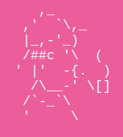

# Holmes

[](https://travis-ci.org/justsocialapps/holmes)

A simple analytics server written in Go, including a JavaScript client library.

Holmes collects tracking information via the provided client library or by
direct calls to the tracking URL, enriches that information with details about
the refering user (such as HTTP Referer, IP Address) and passes this information
on to a Kafka server (on the `tracking` topic).



# Installation

To install Holmes, run 

```
go get github.com/justsocialapps/holmes
```

or grab the binary of the [most current
release](https://github.com/justsocialapps/holmes/releases).

# Running

To start Holmes, simply call `holmes` (assuming that $GOPATH/bin is on your
$PATH), passing the parameters fit to your environment (see below).

# Configuration

The startup configuration of Holmes is provided via command-line parameters.
Type `holmes -h` to get a list of all parameters.

# Usage

Holmes provides a JavaScript client library that exposes a function to track
certain user actions. Include that library into your pages and call the tracking
function whenever appropriate. Here's the script tag for including the lib:
```
<script>
    !function(){var e="HOLMES_BASE_URL/analytics.js",t=document,a=t.createElement("script"),r=t.getElementsByTagName("script")[0];a.type="text/javascript",a.async=!0,a.defer=!0,a.src=e,r.parentNode.insertBefore(a,r)}();
</script>
```

Replace `HOLMES_BASE_URL` with the address where users can reach Holmes. Then
you can start tracking:

```
if (typeof (window.Holmes) === 'undefined') {
    return;
}
window.Holmes.pageView(TRACKING_OBJECT);
```

The check for `window.Holmes` is necessary since the JavaScript will load
asynchronously. `TRACKING_OBJECT` may be any JSON-serializable JavaScript
object. When calling `track`, Holmes will send a JSON object to the Kafka server
that looks like this:

```
{
    referer: HTTP_REFERER,
    ipAddress: REMOTE_IP_ADDRESS,
    time: CURRENT_SERVER_UNIX_TIMESTAMP_IN_MS,
    target: TRACKING_OBJECT
}
```

# License

This software is distributed under the BSD 2-Clause License, see
[LICENSE](LICENSE) for more information.
